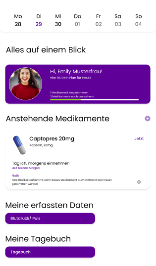
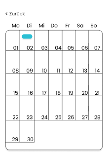
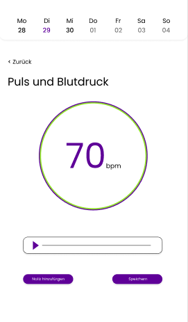
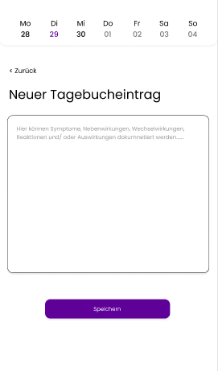

# P4_SS23_Habit_Team7_Beck_Kessler
 
<div style="display: flex; justify-content: space-between;">
<h2>Habit</h2> 
</div>
<hr>

#### Was ist Habit?

Habit ist eine Anwendung, welche in Form eines interaktiven Tagebuchs den Patienten während ihrer medikamentösen Behandlung unterstützend an die Hand gegeben wird. Habit verfolgt das Ziel, die erfassten daten des Patienten zu visualisierten und ihnen die Möglichkeit zu bieten, zusätzliche Notizen zur Medikamenteneinnahme zu tätigen.

#### Unsere Idee

Eine Behandlung wirkt am besten, wenn der Datenaustausch zwischen Patienten und Ärzten, in einer Behandlung so transparent und verständlich wie möglich erfolgt. Die Medikamenteneinnahme kann aufgrund einer Desensibilisierung oder anderen Gründen vorgeschrieben sein. Bei dieser werden die erfassten Daten, welche von unserem Armband zur Verfügung gestellt und übertragen werden, direkt im Netzwerk an das interaktive Tagebuch gesendet, um diese den Patienten zu zeigen. Patienten in der Behandlung zu unterstützen, indem wir ihnen eine Erinnerungsmöglichkeit an die Medikamenteneinname und eine Veranschaulichung ihrer Vitalparameter bieten.

#### Bedienung

<hr>

| Screen                                                                                      | Beschreibung                                                                                                                                                                                                                                                                                                                                                                                                                                                                                                                                         |
| ------------------------------------------------------------------------------------------- | ---------------------------------------------------------------------------------------------------------------------------------------------------------------------------------------------------------------------------------------------------------------------------------------------------------------------------------------------------------------------------------------------------------------------------------------------------------------------------------------------------------------------------------------------------- |
|                   | Die Applikation startet im Homescreen. Von hier aus haben Sie über die Buttons, die Möglichkeit, den Kalender, das Tagebuch, die Datenübersicht und in die Medikamentenübersicht zu gelangen.                                                                                                                                                                                                                                                                                                        |
|                         | 
In der Medikamenten Übersicht sehen Sie alle Medikamente, welche Sie einnehmen müssen. Zusätzlich sehen Sie wann und in welcher Dosis diese einznehmen sind. Haben sie ein Medikament bereits zu sich genommen, gilt dieses in der Liste als "abgehakt". |
|               | In der Im Kalender werden unregelmäßige Messungen in Terminform angezeigt. Wenn Sie auf diese klicken werden sie eine detailierte Ansicht der Messung bekommen.                                                                                                                                                                                                                                                                                                                                                                                                     |
|                           | Wollen Sie ein In der Übersicht der Vitalwerte, sehen Sie eine genaue Darstellung der Messung und haben die Möglichkeit zu dieser mittels des Button "Tagebuch" eine Notiz hinzuzufügen, welche der Arzt nach dem abschicken einsehen kann.                                                                                                                                                                                                                                                                                                                            |
|                         | In der Das Tagebuch dient dazu Notizen festzuhalten zu bestimmten Messungen eines Vitalparameters. Hierzu zählen: Symptome, Nebenwirkungen etc.. Nach dem speichern dieser mittels des Button "Speichern" werden diese dem Arzt zur Verfügung gestellt. Mit dem "X" Knopf, löschen Sie ihre Eingabe.                                                                                                                                                                                                                                                                         |                                                           

#### Inbetriebnahme

###### Web-App

1. Dieses Repository Klonen
2. Ein Terminal Fenster starten und in das Repository Verzeichnis navigieren
3. In den richtigen Ordner im Terminal navigieren: `cd med-buddy` ausführen
4. `npm install` ausführen
5. `npm start` ausführen. Das Projekt öffnet sich unter **localhost:3000**

Abhängigkeiten der Web-App (Links):
[`create-react-app`](https://www.npmjs.com/package/create-react-app)
[`react-router`](https://www.npmjs.com/package/react-router)
[`react-icons`](https://www.npmjs.com/package/react-icons)
[`react-calender`](https://www.npmjs.com/package/react-calendar)

###### Hardware / interaktives Tagebuch/ Armband (ESP8266)

Interaktives Tagebuch

1. LCD 7 Display-C an den Raspberry Pi 3 per HDMI und USB anschließen
2. Eine externe Stromquelle an den Raspberry Pi anschließen
3. Sobald alles richtig verkabelt ist, ist nachdem Hochfahren unsere React Applikation zu sehen
4. Nun kann man die App nutzen

Armband

1. ESP per USB an den Computer anschließen
2. Die Datei `Puls.ino` über die [Arduino-IDE](https://www.arduino.cc/en/software) öfnnen.
3. Im Code müssen die WLAN-Anmeldedaten editiert werden.

```
const char* ssid = "SSID";
const char* password = "Password";
```

4. Die editierte `Pulssensor.ino` auf den Mikrocontroller hochladen.

5. Über den Seriellen-Monitor wird die IP-Addresse des Armbandes angezeigt.

6. Nun kann man den Pulssensor in die Hand nehmen um die Herzfrequenz zu messen

7. Diese wird in BPM im interaktiven Tagebuch im dafür gestalteten Screen angezeigt
(Die Datenübertragung für die Messwerte des Pulses funktioniert leider nur Lokal und nicht über Vercel. Das heißt auf dem Display werden die Werte nicht angezeigt, sondern nur lokal am PC/Laptop etc.).

Abhängigkeiten der Hardware (Links):
[`esp8266 Board Manager`](http://arduino.esp8266.com/stable/package_esp8266com_index.json)

#### Link

[Zur App]: https://p4-ss-23-habit-team7-beck-kessler.vercel.app/

```
Habit

Hochschule Darmstadt - Sommersemester 23 - Fachsemester 4
Ein Semesterprojekt von Emma Beck und Isabella Kessler
```
